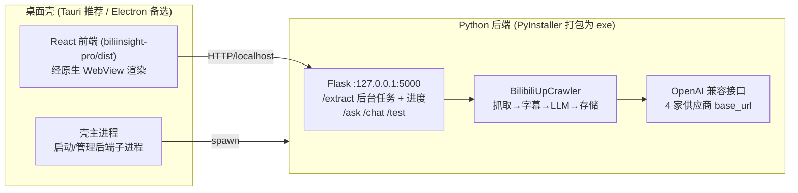

# PRD：Bili_summary 桌面端封装

> 文档版本：v1.0 ｜ 日期：2026-08-02 ｜ 产品经理：许清楚（Xu / Alice）
> 文档档位：**简单 PRD（默认模式）**
> 关联资料：`docs/architecture_review.md`、`docs/security_audit.md`、`docs/quality_review.md`

---

## 1. 项目信息

| 项 | 内容 |
|----|------|
| Language | 中文（与用户需求一致） |
| Programming Language | 后端 Python 3.8+（Flask + bilibili-api-python）；前端 React 19 + Vite + shadcn/ui；桌面壳 Electron / Tauri（待定，见第 4 节） |
| Project Name | `bili_summary_desktop` |
| 原始需求复述 | 来自 Lawrence（大三电子信息专业）：「完善这个项目，要求封装成电脑端的软件，打开流畅可用，apikey 先用着，后续弄一个登录入口给用户填写 apikey。」解读为：(1) 封装成 Windows 桌面软件（开箱即用、流畅），替代当前「起 Flask + 前端 dev server」的网页形态；(2) 本期沿用现有本地 config 中的 API key，不强制用户一打开就填；(3) 后续登录入口列为明确的迭代规划（本期先做"设置/偏好"面板让用户填自己的 key，再演进为登录）。 |

---

## 2. 产品定义

### 2.1 Product Goals（3 个正交目标）

1. **开箱即用的桌面体验**：用户双击 `.exe` 即可打开图形界面并开始使用，无需手动启动 Flask、无需起前端 dev server、无需配置环境。
2. **流畅可感知的进度**：把现有同步阻塞的 `/api/extract` 流水线改为后台任务 + 真实进度回传，避免界面卡死数分钟、假进度条。
3. **密钥安全与平滑演进**：本期密钥本地安全存储（不再明文写死/不再存 localStorage），并预留"设置面板 → 登录入口"的演进路径。

### 2.2 User Stories

- **As a 普通用户**，我希望双击桌面图标即可打开软件并直接开始提炼 UP 主观点，这样我不需要懂 Python 或命令行。
- **As a 普通用户**，我希望在批量处理几十个视频时能看到真实进度和"已处理 / 总数"，这样我知道程序在跑、没卡死。
- **As a 进阶用户（Lawrence）**，我希望在"设置"里填入自己的模型 API key（OpenAI / DeepSeek / SiliconFlow / DashScope），这样我可以脱离内置 key 用自己的额度。
- **As a 产品 owner**，我希望桌面壳能复用现有 Python 引擎代码，不要重写一遍抓取/字幕/LLM 逻辑，这样维护成本最低。
- **As a 未来用户**，我希望后续能用一个账号登录并管理我的 key，这样换设备也能同步偏好（本期仅规划，不实现）。

---

## 3. 技术规范

### 3.1 Requirements Pool

#### P0（Must have —— 本期交付核心）

| ID | 需求 | 验收标准 |
|----|------|----------|
| P0-1 | **桌面壳打包与自启动** | 双击生成的 `.exe` 后自动拉起 Python 后端（PyInstaller 打包的 Flask 后端）并加载前端界面；启动后无需任何手动命令即可使用。 |
| P0-2 | **单一前端承载** | 桌面内只运行一套前端（保留 React 版 `biliinsight-pro`，归档/移除原生 `web/`）。界面功能覆盖：输入 UID、设置最大视频数、查看每集核心观点、整体总结、基于观点的问答、导出 Excel/Markdown/JSON。 |
| P0-3 | **真实进度回传** | `/api/extract` 改为后台任务（线程/进程 + 任务 ID），新增 `/api/extract/status` 轮询或 SSE 推送，前端显示真实「已处理/总数 + 当前视频标题」进度，杜绝假进度条。 |
| P0-4 | **API key 本地安全存储** | 内置默认 key 自 config 读取（沿用"先用着"），但**不再把真实 key 提交进仓库**；用户自行填写的 key 存于系统钥匙串 / 加密本地文件，不进 localStorage、不出现在前端 JS 明文。 |
| P0-5 | **关闭局域网无鉴权暴露** | 后端绑定 `127.0.0.1`（不再 `0.0.0.0`），桌面壳内访问即可；取消对局域网任意人的开放触发，避免他人盗用付费模型。 |

#### P1（Should have —— 强烈建议本期或紧接迭代）

| ID | 需求 | 验收标准 |
|----|------|----------|
| P1-1 | **"设置 / 偏好"面板** | 提供图形化设置页：可选模型供应商、填自己的 API key、设温度/最大 token/最大视频数；保存后即时生效并持久化。 |
| P1-2 | **统一密钥处理链路** | 修复当前不一致：`/api/extract` 收前端 key，而 `/api/chat`、`/api/ask` 只用服务端 config key。统一为：后端以"用户设置 key > 内置默认 key > 无则报错提示"的优先级解析，前端不再传 key（V2 当前硬编码 `model_type='dashscope'` 且不传 key，需与后端一致）。 |
| P1-3 | **导出与历史** | 结果可一键导出 Excel/Markdown/JSON 到用户选定目录；保留本地理史记录列表可再次查看。 |
| P1-4 | **XSS 加固** | 模型输出统一用 React 受控渲染 / 文本节点（V1 `script.js` 的 `innerHTML` 改为安全渲染）；前端不回显原始 key。 |

#### P2（Nice to have —— 后续迭代）

| ID | 需求 | 验收标准 |
|----|------|----------|
| P2-1 | **登录入口** | 提供账号登录入口，云端托管 key 与偏好，跨设备同步（承接用户"后续登录入口"诉求）。 |
| P2-2 | **Whisper 音频转写恢复** | README 声称但代码已禁用的无字幕音频转写，作为可选开关重新评估（需权衡包体与离线依赖）。 |
| P2-3 | **架构解耦** | 把 `main.py` 单类 `BilibiliUpCrawler`（抓取/字幕/LLM/存储全耦合）拆分为可测试模块，降低后续维护成本。 |
| P2-4 | **macOS / Linux 包** | 在 Windows 版稳定后，补充跨平台打包。 |

### 3.2 UI 设计稿

#### 整体布局（文字 / ASCII）

```
┌───────────────────────────────────────────────────────────┐
│  BiliInsight                        [设置⚙] [导出▾]         │  Header
├───────────────┬───────────────────────────────────────────┤
│  左侧栏        │   主工作区                                  │
│  ───────       │   ┌─────────────────────────────────────┐  │
│  [+ 新建分析]  │   │ UID: [______________]  最多[N]个视频  │  │
│  ───────       │   │ [ 开始提炼 ]                         │  │
│  历史记录       │   │ 进度: ███████░░░ 7/30  (当前: xxx)   │  │
│  • UP主A 08-01 │   └─────────────────────────────────────┘  │
│  • UP主B 07-28 │   ┌─────────────────────────────────────┐  │
│               │   │ 整体总结                              │  │
│               │   │ （Markdown 渲染，安全文本节点）        │  │
│               │   ├─────────────────────────────────────┤  │
│               │   │ 每集观点列表 / 问答对话               │  │
│               │   └─────────────────────────────────────┘  │
└───────────────┴───────────────────────────────────────────┘

设置面板（弹窗 / 独立页）：
  • 模型供应商：○ OpenAI ○ DeepSeek ○ SiliconFlow ○ DashScope
  • API Key： [ **************** ]  （保存至系统钥匙串）
  • 温度 / 最大 Token / 最大视频数： [数值输入]
  • 保存路径： [选择文件夹]
```

#### 进程架构（Mermaid）



### 3.3 Open Questions / 待确认问题

见第 4 节「关键决策点（必须确认）」。

---

## 4. 关键决策点（必须确认）

> 以下三点直接决定本期工程量与技术路线，需主理人 / 开发负责人拍板。

### 决策点 A：桌面框架选型 + Python 后端如何塞进桌面程序

| 方案 | 包体 | 流畅度 | 复用现有 Python | 工程量 | 结论建议 |
|------|------|--------|------------------|--------|----------|
| **A1 Electron + spawn Python 子进程** | 大（~150MB+，含 Chromium + Node） | 好 | 完全复用（Flask exe + React 原样） | 低（最快出包） | 上手最快，但包重 |
| **A2 Tauri + spawn Python 子进程** | 小（WebView2 复用系统，Python 仍须随包） | 好 | 完全复用 | 中（Rust 壳 + 打包 Python） | **推荐**：包体远小于 Electron，原生感好 |
| **A3 PyInstaller + pywebview（纯 Python）** | 小（系统 WebView2 + Python） | 好 | 完全复用 | 中低 | 最"Python 原生"，适合学生维护，但 pywebview 生态略弱 |
| **A4 Node 重写后端** | 小 | 好 | **不复用**，重写抓取/字幕/LLM | 高 | 不推荐，违背"先用着、低维护"目标 |

**推荐路线**：**A2（Tauri）为主方案**，后端用 **PyInstaller 打包 `web/app.py` + `main.py` 为单个 exe**，由 Tauri（Rust）主进程在应用启动时 spawn 该 exe，前端用 `biliinsight-pro` 的 `dist` 构建产物经 WebView2 渲染、通过 `127.0.0.1:5000` 通信。**A3（pywebview）** 作为更轻量、纯 Python 的备选。
> 关键约束：无论哪种，都保留 Python 引擎代码，不重写；后端只绑定 `127.0.0.1`。

### 决策点 B：API key 本期如何存，与"后续登录入口"如何衔接

- **本期（开箱即用）**：沿用内置默认 key（从 config 读取，但**立即从仓库移除明文 key**），用户首次打开即可直接用。
- **本期（用户自填）**：在 P1-1「设置面板」中让用户填自己的 key，**存入 Windows 凭据管理器 / 加密本地文件**（用 `keytar` 或平台等价物），**绝不进 localStorage、绝不前端明文**。
- **后端取 key 优先级统一为**：用户设置 key → 内置默认 key → 都无则前端提示"请在设置中填写 key"。（消除当前 `/extract` 与 `/chat`、`/ask` 不一致）
- **衔接登录入口（P2-1）**：设置面板是登录入口的"本地前置形态"；后续登录入口上线后，本地 key 可作为"离线兜底"，云端账号 key 作为"同步主用"。架构上把"密钥提供方"抽象成接口，本地存储与云端账户都实现该接口即可平滑切换。

### 决策点 C：是否借机合并 V1 / V2 两套前端

- **建议：保留 React 版（`biliinsight-pro`），归档原生 `web/` 目录。** 理由：两套功能几乎一致却零代码共享，且 V1 存在 `innerHTML` XSS 与 localStorage 存 key 风险；V2 技术栈更现代（React 19 + shadcn/ui）。
- **动作**：桌面壳只打包 V2 的 `dist`；将 `web/` 移入 `archive/web-v1/`（保留可追溯，不再维护）；删除 V2 中硬编码 `model_type='dashscope'` 的写死逻辑，改为读统一设置。

---

## 5. 待确认问题（Open Questions）

1. **框架最终选型**：A2（Tauri）还是 A3（pywebview）还是 A1（Electron）？影响打包流程与体积目标。
2. **包体体积上限**：是否有可接受安装包上限（如 < 200MB）？决定 Python 运行时随包还是要求预装。
3. **内置默认 key 的处理**：当前 `config.py` 含一个真实 DashScope key —— 本期是「保留为内置默认（仅本地打包，不入仓库）」还是「完全移除、强制用户自填」？
4. **目标平台**：本期仅 Windows 10/11，还是也要覆盖 macOS？
5. **进度实现方式**：用轮询 `/api/extract/status` 还是 SSE 推送？影响后端改动量（倾向 SSE，更实时）。
6. **设置面板范围**：P1 是否包含「多 UP 主批量队列」？还是仅单 UP 主？
7. **登录入口时机**：P2-1 是下个迭代就做，还是仅规划？

---

## 附：已核实的现状事实（用于开发对齐，非需求）

- 后端：`web/app.py` Flask `0.0.0.0:5000`，路由 `/api/extract`(同步阻塞整条流水线)、`/api/ask`、`/api/chat`、`/api/test`。
- 引擎：`main.py` 单类 `BilibiliUpCrawler` 全耦合；4 家供应商走 OpenAI 兼容接口（`base_url` 区分），构造器已支持 `model_type` + `api_keys` 注入。
- 前端 V1：`web/` 原生 HTML/JS，`script.js` 从 localStorage 读 key 并 `innerHTML` 渲染输出（XSS/泄露风险）。
- 前端 V2：`biliinsight-pro/` React 19 + Vite，端口 3000；`useExtraction.ts:37` 硬编码 `model_type:'dashscope'` 且不传 key，依赖服务端 config。
- 启动：`启动工具.bat` 仅 spawn `python web\app.py` 并开浏览器，非桌面形态。
- 安全存量：`config.py` 明文含真实 DashScope key（须从仓库清理）；`README.md` 声称的 Whisper 音频转写代码已禁用。
