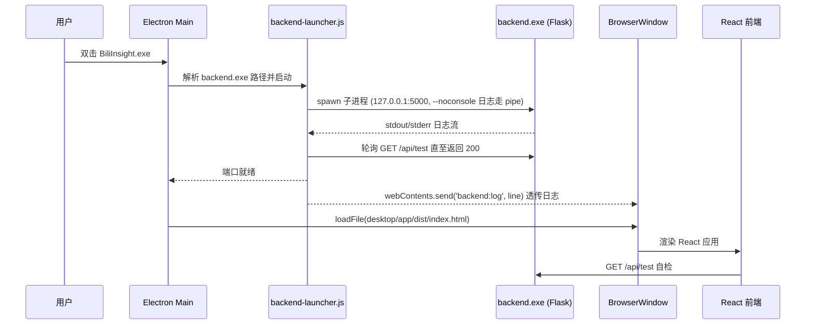
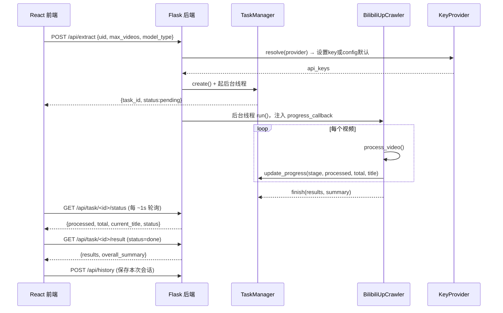
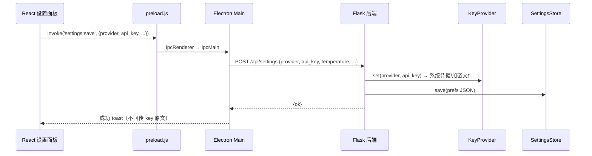
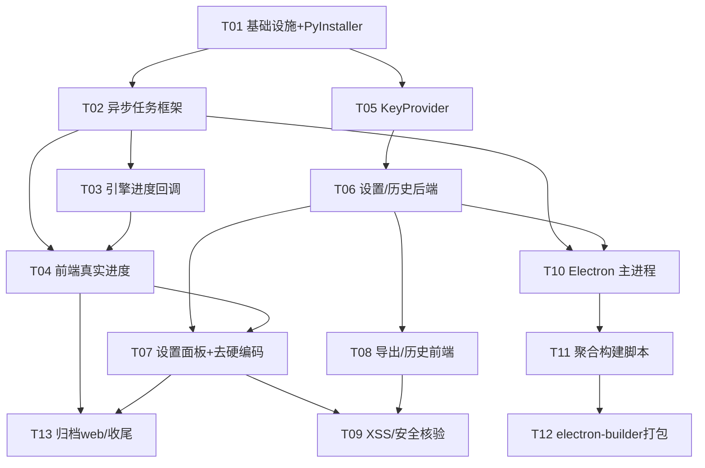

# 系统架构设计：Bili_summary 桌面端封装

> 文档版本：v1.0 ｜ 日期：2026-08-02 ｜ 架构师：高见远（Gao）
> 输入：PRD `docs/prd-desktop-2026-08-02.md`（许清楚）
> 主理人已拍板约束：Windows 桌面 / Electron+PyInstaller 主方案 / 本地 key 沿用+设置面板 / 保留 React 归档原生 web / 解决假进度条

---

## Part A：系统设计

### 1. 实现方案（Implementation Approach）

#### 1.1 技术难点

| 难点 | 说明 |
|------|------|
| Python 引擎塞进桌面程序 | 现有抓取/字幕/LLM 逻辑全在 `main.py`，不能用 Node 重写；需以子进程方式随桌面壳启动。 |
| 假进度条 | 当前 `/api/extract` 同步阻塞整条流水线数分钟，前端只能造假的 10%→100%。 |
| 密钥安全 | `config.py` 明文 key、`web/script.js` 用 localStorage 存 key、前后端取 key 逻辑不一致。 |
| 开箱即用 | 双击 `.exe` 即起后端 + 前端，无需命令行、无需 dev server、无需配环境。 |
| 局域网暴露 | `app.run(host='0.0.0.0')` 把付费模型对局域网开放，须改为 `127.0.0.1`。 |

#### 1.2 框架与库选型（含理由）

| 层 | 选型 | 理由 |
|----|------|------|
| 桌面壳（主方案） | **Electron 主进程 + PyInstaller onefile `backend.exe` 作为 sidecar** | 主理人硬约束：能真出可运行 Windows 包 + 最大化复用现有 Python。**完全复用** Flask + `BiliUpCrawler`，工程量最低、出包最快。 |
| 后端 | **Flask（保持不变）+ PyInstaller `--onefile`** | 现有 `web/app.py` 原样改造，打包为单个 `backend.exe`，由 Electron `spawn`。 |
| 前端 | **React 19 + Vite + shadcn/ui（`biliinsight-pro/`）** | 保留 V2；`web/` 原生版归档。生产构建 `dist` 由 BrowserWindow 加载。 |
| 密钥存储 | **后端 `keyring`（Windows 走系统凭据管理器）+ `cryptography` 加密文件兜底** | 桌面壳不碰 key；key 仅在后端进程内解析并喂给引擎，前端/Electron 永不明文持有。满足"不进 localStorage、不进前端代码"。 |
| 进度 | **后端后台线程 + 内存 `TaskManager` + 前端轮询 `/api/task/<id>/status`**（SSE 作为可选增强） | 轮询最稳、无缓冲/断流问题，适合 Electron 内网通信；PRD 允许轮询或 SSE。 |
| 打包 | **electron-builder** | 生成 Windows 安装包（NSIS），`extraResources` 随包携带 `backend.exe` 与前端 `dist`。 |

**备选方案（仅简述，不作为本实现）**
- **Tauri（Rust 壳 + WebView2）**：包体远小于 Electron（系统 WebView2，Python 仍随包），原生感更好；但需 Rust 工具链、Rust↔Python 子进程管理更复杂、与现有 Node/Vite 生态衔接成本更高，工程量中等偏上。本期选定 Electron 出包最快、最稳，Tauri 留待后续评估。
- **pywebview（纯 Python 壳）**：最"Python 原生"、适合学生维护；但生态/打包成熟度弱于 Electron，桌面体验细节少。**不采用**。
- **Node 重写后端**：违背"复用现有 Python、低维护"，**明确禁止**。

#### 1.3 架构模式

- 桌面壳 = **主控进程（Electron Main）** 负责生命周期、spawn 后端、IPC 桥接。
- 后端 = **Flask 服务 + 后台任务（TaskManager）** 模式，sidecar 化。
- 前端 = **React 单向数据流（hooks + context）**，通过 `client.ts` 统一访问后端，设置项经 IPC→后端落库（key 不回流前端）。
- 密钥 = **KeyProvider 策略接口**：`LocalKeyProvider`（本期）与未来 `RemoteKeyProvider`（P2 登录）实现同一接口，平滑演进。

---

### 2. 文件列表（File List，相对路径基于 `Bili_summary/`）

#### 2.1 后端 / 引擎（Python，保留并改造）
| 路径 | 动作 | 说明 |
|------|------|------|
| `main.py` | 修改 | `BilibiliUpCrawler` 构造器新增 `progress_callback` 参数；`process_all_videos` 每处理一个视频调用回调上报进度（仍单类，不拆分，P2-3 留未来）。 |
| `web/app.py` | 修改 | 绑定 `127.0.0.1`；CORS 收紧到 localhost；`/api/extract` 改异步；新增 `/api/task/<id>/status`、`/api/task/<id>/result`、`/api/settings`、`/api/history`、`/api/export`；统一 key 解析（经 `KeyProvider`）；不再返回明文 key。 |
| `web/key_provider.py` | **新增** | `KeyProvider` 抽象 + `LocalKeyProvider`（`keyring` → Windows 凭据管理器，失败回退 `cryptography` 加密文件）；`resolve(provider)` 优先级：设置 key > `config` 内置默认。 |
| `web/task_manager.py` | **新增** | 内存 `TaskManager`：创建任务、后台线程跑 `crawler.run`、写进度、存结果。 |
| `web/settings_store.py` | **新增** | 用户偏好（provider/温度/最大 token/最大视频数/保存路径）持久化到 `%APPDATA%/BiliInsight/prefs.json`。 |
| `web/history_store.py` | **新增** | 历史记录持久化到 `%APPDATA%/BiliInsight/history.json`。 |
| `config.py` | 保留（已被 `.gitignore` 忽略） | 内置默认 key 沿用（"先用着"），仅本地打包入 exe，**不入仓库**。 |
| `config.example.py` | 修改 | 同步注释"内置 key 须本地填、勿提交"。 |
| `requirements.txt` | 修改 | 增加 `keyring`、`cryptography`。 |

#### 2.2 桌面壳（Electron，新增 `desktop/`）
| 路径 | 动作 | 说明 |
|------|------|------|
| `desktop/package.json` | **新增** | Electron 应用依赖 + `electron-builder` 构建配置（`build` 段含 `files`/`extraResources`/NSIS）。 |
| `desktop/main.js` | **新增** | 主进程：解析 `backend.exe` 路径 → spawn → 等端口就绪 → 创建 `BrowserWindow` 加载前端；注册 IPC；退出时杀子进程。 |
| `desktop/preload.js` | **新增** | `contextBridge`：暴露 `settings:save/get`、`dialog:showSaveDialog`、接收 `backend:log` 日志通道。前端永远拿不到 key 原文。 |
| `desktop/backend-launcher.js` | **新增** | `spawn` 子进程 + 轮询 `GET /api/test` 直到就绪 + 透传 stdout/stderr 到主进程与渲染进程。 |
| `desktop/build.mjs` | **新增** | 聚合构建脚本：构建 React(`npm run build`)→ 拷贝 `biliinsight-pro/dist` 到 `desktop/app/dist`；构建/拷贝 `backend.exe` 到 `desktop/app/backend.exe`。 |
| `desktop/build-resources/icon.ico` | **新增** | 安装包/窗口图标（资源）。 |

#### 2.3 前端（React，保留并改造 `biliinsight-pro/`）
| 路径 | 动作 | 说明 |
|------|------|------|
| `biliinsight-pro/src/api/client.ts` | 修改 | 基址保持 `http://localhost:5000`（桌面内即本机）；新增 `getTaskStatus`、`getTaskResult`、`getSettings`、`saveSettings`、`getHistory`、`addHistory`、`exportResult` 封装；`extractVideos` 改发异步任务。 |
| `biliinsight-pro/src/hooks/useExtraction.ts` | 修改 | 删除硬编码 `model_type:'dashscope'`；改为从设置读取；`handleExtract` 改为：发异步任务 → 轮询进度 → 取结果（真实进度，非假 10%→100%）。 |
| `biliinsight-pro/src/hooks/useSettings.ts` | **新增** | 设置读写 hook（经 IPC/HTTP），管理 provider、key（仅 send 不回显）、温度、最大 token、最大视频数、保存路径。 |
| `biliinsight-pro/src/hooks/useHistory.ts` | 修改 | 由 localStorage 改为后端 `/api/history`（持久化、跨会话）。 |
| `biliinsight-pro/src/components/SettingsPanel.tsx` | **新增** | 设置/偏好弹窗：模型供应商单选、API Key 输入（密码框）、温度/最大 token/最大视频数、保存路径选择。 |
| `biliinsight-pro/src/components/Header.tsx` | 修改 | 增加"设置⚙"按钮，打开 `SettingsPanel`。 |
| `biliinsight-pro/src/components/ResultsView.tsx` | 修改 | 增加"导出"按钮（Excel/Markdown/JSON），经 `dialog:showSaveDialog` 选路径后调 `/api/export`。 |
| `biliinsight-pro/src/App.tsx` | 修改 | 挂载 `SettingsPanel`、把设置/历史/真实进度接入。 |
| `biliinsight-pro/vite.config.ts` | 修改（可选） | 设 `base: './'` 以便 `file://` 加载静态资源。 |

#### 2.4 打包脚本与归档
| 路径 | 动作 | 说明 |
|------|------|------|
| `pyinstaller/build-backend.spec` | **新增** | PyInstaller onefile spec：入口 `web/app.py`，隐藏控制台（`--noconsole` 不适合排错，改为 `--windowed` 否，保留控制台日志经 Electron 透传；用 `--onefile`，`datas` 携带 `config.py`、`results/` 模板）。 |
| `pyinstaller/build_backend.py` | **新增** | 一键调用 PyInstaller 的 Python 脚本（便于 CI/本地复用）。 |
| `archive/web-v1/` | **移动** | 把原生 `web/` 的 `script.js`/`index.html`/`styles.css` 移入归档（保留可追溯、不再维护）。 |

---

### 3. 数据结构与接口（Data Structures & Interfaces）

```mermaid
classDiagram
    class KeyProvider {
        <<interface>>
        +resolve(provider: str) str
        +set(provider: str, key: str) void
        +has(provider: str) bool
    }
    class LocalKeyProvider {
        -_file_path: str
        +resolve(provider) str
        +set(provider, key) void
        +has(provider) bool
        -_from_keyring(provider) str
        -_from_file(provider) str
        -_to_file(provider, key) void
    }
    class TaskManager {
        -_tasks: dict
        +create(params) str
        +get(task_id) Task
        +update_progress(task_id, stage, processed, total, current_title) void
        +finish(task_id, results, summary) void
    }
    class Task {
        +id: str
        +status: str
        +stage: str
        +processed: int
        +total: int
        +current_title: str
        +results: list
        +overall_summary: str
    }
    class SettingsStore {
        -_path: str
        +load() dict
        +save(prefs: dict) void
    }
    class HistoryStore {
        -_path: str
        +list() list
        +add(session: dict) void
        +clear() void
    }
    class BilibiliUpCrawler {
        +up_mid: str
        +max_videos: int
        +progress_callback: Callable
        +run() void
        +process_video(v: dict) dict
        +generate_overall_summary() str
    }
    class FlaskApp {
        +POST /api/extract
        +GET  /api/task/&lt;id&gt;/status
        +GET  /api/task/&lt;id&gt;/result
        +GET/POST /api/settings
        +GET/POST /api/history
        +POST /api/export
        +GET  /api/test
    }
    KeyProvider <|.. LocalKeyProvider
    TaskManager *-- Task
    FlaskApp ..> TaskManager : 创建/驱动后台任务
    FlaskApp ..> KeyProvider : 解析密钥(设置&gt;默认)
    FlaskApp ..> SettingsStore : 持久化偏好
    FlaskApp ..> HistoryStore : 持久化历史
    FlaskApp ..> BilibiliUpCrawler : 后台线程内构造并 run
    BilibiliUpCrawler ..> TaskManager : progress_callback 上报
```

**关键 REST 接口（响应统一 `{success, data, message}`）**

| 方法 & 路径 | 入参 | 返回 | 说明 |
|------------|------|------|------|
| `POST /api/extract` | `{uid, max_videos, model_type?}`（前端不再传 key） | `{task_id, status}` | 异步：建任务 + 起后台线程即返回。 |
| `GET /api/task/<id>/status` | — | `{stage, processed, total, current_title, status}` | 前端轮询真实进度。 |
| `GET /api/task/<id>/result` | — | `{results, overall_summary}` | 任务 `done` 后取最终结果。 |
| `GET /api/settings` | — | `{provider, has_key, temperature, max_tokens, max_videos, save_path}`（**key 不返回原文**） | 拉当前设置。 |
| `POST /api/settings` | `{provider, api_key?, temperature, max_tokens, max_videos, save_path}` | `{ok}` | 存 key（经 `KeyProvider` 落系统凭据/加密文件）+ 存偏好。 |
| `GET /api/history` | — | `{sessions: [...]}` | 历史列表。 |
| `POST /api/history` | `{session}` | `{ok}` | 追加历史。 |
| `POST /api/export` | `{format, path, results, overall_summary}` | `{path}` | 后端用 pandas/openpyxl 写出文件到用户选定路径。 |
| `GET /api/test` | — | `{success:true}` | 端口健康自检（Electron 启动探活用）。 |

---

### 4. 程序调用流程（Call Flow）

#### 4.1 启动：Electron 拉起后端并加载前端


#### 4.2 提炼：异步任务 + 真实进度轮询


#### 4.3 设置保存：key 永不明文回流前端


---

### 5. 待明确事项（仅剩需用户拍板者）

> 主理人约束已解决绝大多数决策；以下仅列真正仍需拍板的少量项。

| # | 事项 | 为何需要拍板 | 我的建议（供参考，非默认） |
|---|------|--------------|---------------------------|
| Q1 | **安装包体积上限是否敏感** | 决定 Python 运行时是"随包内置（包体约 +40~80MB，开箱即用）"还是"要求用户本机预装 Python 3.8+（包小但非开箱即用）"。 | 主理人要求"打开流畅可用"，建议 **Python 随包（onefile exe）**，包体可放宽至 < 300MB。 |
| Q2 | **设置面板本期是否支持"多 UP 主批量队列"** | 影响 `TaskManager` 是否要支持队列与并发；PRD P1-1 未明确。 | 建议本期仅**单 UP 主**顺序任务，`TaskManager` 预留队列接口即可，降低本期工程量。 |

> 已明确、不再重复列入：框架选型（Electron+PyInstaller）、key 流程（本地 config + 设置面板 + KeyProvider 抽象）、前端（保留 React 归档原生 web/）、平台（仅 Windows）、进度实现（轮询为主、SSE 可选——我按轮询落地）。

---

## Part B：任务分解

> 说明：本任务列表已按你"中大型增量开发、细化到文件级、有序含依赖"的要求展开为 **13 个文件级任务、分 4 批**；这超越了角色默认 ≤5 任务的软上限，但符合你作为主理人的显式指令，故以此为准。

### 6. 依赖包列表（Required Packages）

**Python（`requirements.txt` 增加）**
```
- Flask>=3.0.0            # 后端（已有）
- Flask-CORS>=4.0.0       # 跨域（已有，收紧到 localhost）
- keyring>=24.0.0         # Windows 凭据管理器存储 key（新增）
- cryptography>=42.0.0    # 加密本地文件兜底（新增）
- bilibili-api-python>=1.5.0  # 引擎（已有）
- openai>=1.0.0           # LLM（已有）
- pandas>=2.0.0 / openpyxl>=3.1.0  # 导出 Excel（已有）
- requests>=2.31.0        # 字幕下载（已有）
```

**Node（`desktop/package.json`）**
```
- electron@^31            # 桌面壳主进程
- electron-builder@^24    # Windows 安装包构建
（无需 keytar：key 由后端 KeyProvider 落库，前端/Electron 不持有明文）
```

**前端（`biliinsight-pro/package.json` 已有）**
```
- react@^19 / react-dom@^19 / vite@^6 / shadcn / react-markdown（安全渲染，已有）
```

---

### 7. 任务列表（有序、含依赖、按实现顺序）

#### 批次 B1：基础设施 + 后端异步化骨架（P0）

**T01 — 项目基础设施与 PyInstaller 打包骨架**
- 源文件：`pyinstaller/build-backend.spec`、`pyinstaller/build_backend.py`、`requirements.txt`（增 keyring/cryptography）、`config.example.py`（注释）、`desktop/package.json`（初版）
- 依赖：无
- 优先级：P0
- 内容：建立 PyInstaller onefile spec（入口 `web/app.py`、携带 `config.py`/`results` 模板、输出 `backend.exe`）；声明桌面端 Node 依赖。

**T02 — 后端异步任务框架（TaskManager + 路由改造）**
- 源文件：`web/task_manager.py`（新增）、`web/app.py`（改 `/api/extract` 异步 + 新增 `/api/task/<id>/status`、`/api/task/<id>/result`；绑定 `127.0.0.1`；CORS 收紧 localhost）
- 依赖：T01
- 优先级：P0
- 内容：`TaskManager` 内存任务 + 后台线程驱动 `crawler.run`；路由返回 `task_id` 并支持状态/结果查询。

**T03 — 引擎进度回调改造**
- 源文件：`main.py`（构造器加 `progress_callback`；`process_all_videos` 每视频调用回调；`run()` 适配后台线程）
- 依赖：T02
- 优先级：P0
- 内容：最小侵入式改造，让引擎把"已处理/总数/当前标题"回传给 `TaskManager`，不动单类结构（P2-3 解耦留未来）。

**T04 — 真实进度前端接入（轮询）**
- 源文件：`biliinsight-pro/src/api/client.ts`（新增 `getTaskStatus`/`getTaskResult`/`extractVideos` 改异步）、`biliinsight-pro/src/hooks/useExtraction.ts`（删假进度，改为轮询 `status` 计算真实百分比）、`biliinsight-pro/src/components/ExtractionPanel.tsx`（进度条接真实值）
- 依赖：T02、T03
- 优先级：P0
- 内容：彻底替换"假进度条 10%→100%"为真实轮询进度。

#### 批次 B2：密钥安全与设置链路（P0/P1）

**T05 — KeyProvider 与本地密钥存储**
- 源文件：`web/key_provider.py`（新增）、`requirements.txt`（确认 keyring/cryptography）
- 依赖：T01
- 优先级：P0
- 内容：`KeyProvider` 抽象 + `LocalKeyProvider`（keyring→Windows 凭据；失败回退加密文件）；`resolve(provider)` 优先级 = 设置 key > `config` 默认。

**T06 — 设置与历史后端接口 + 持久化**
- 源文件：`web/app.py`（新增 `/api/settings` GET/POST、`/api/history` GET/POST）、`web/settings_store.py`（新增）、`web/history_store.py`（新增）
- 依赖：T05
- 优先级：P1
- 内容：后端统一 key 解析（消除 `/extract` 与 `/chat`、`/ask` 不一致）；设置/历史落 `%APPDATA%/BiliInsight/`；`/api/settings` 不返回 key 明文。

**T07 — 前端设置面板 + 去除硬编码 model_type**
- 源文件：`biliinsight-pro/src/components/SettingsPanel.tsx`（新增）、`biliinsight-pro/src/hooks/useSettings.ts`（新增）、`biliinsight-pro/src/hooks/useExtraction.ts`（model_type 改读设置）、`biliinsight-pro/src/components/Header.tsx`（设置按钮）、`biliinsight-pro/src/App.tsx`（挂载面板）
- 依赖：T04、T06
- 优先级：P1
- 内容：图形化设置面板（供应商/key/温度/最大 token/最大视频数/保存路径），key 经 IPC→后端存储，前端仅 send 不回显。

#### 批次 B3：导出/历史与 XSS 收尾（P1）

**T08 — 导出与历史前端闭环**
- 源文件：`web/app.py`（新增 `/api/export`）、`biliinsight-pro/src/api/client.ts`（增 `exportResult`/`getHistory`/`addHistory`）、`biliinsight-pro/src/hooks/useHistory.ts`（改后端）、`biliinsight-pro/src/components/ResultsView.tsx`（导出按钮 + 保存对话框）
- 依赖：T06
- 优先级：P1
- 内容：一键导出 Excel/Markdown/JSON 到用户选定目录；历史记录跨会话持久化。

**T09 — XSS / 安全加固核验**
- 源文件：`biliinsight-pro/src/App.tsx`、各渲染组件（确认 `react-markdown` 安全渲染无 `innerHTML`）、`web/app.py`（确认不回显 key）
- 依赖：T07
- 优先级：P1
- 内容：模型输出走受控文本节点；前端不回显 key；CORS/绑定复核。

#### 批次 B4：Electron 壳与打包发布（P0）

**T10 — Electron 主进程与后端拉起**
- 源文件：`desktop/main.js`（新增）、`desktop/backend-launcher.js`（新增）、`desktop/preload.js`（新增）
- 依赖：T02、T06
- 优先级：P0
- 内容：spawn `backend.exe` → 探活 `/api/test` 就绪 → 创建窗口；IPC（`settings`、`dialog`、`backend:log`）；退出杀子进程。

**T11 — 聚合构建脚本**
- 源文件：`desktop/build.mjs`（新增）
- 依赖：T10
- 优先级：P0
- 内容：构建 React → 拷贝 `biliinsight-pro/dist` 到 `desktop/app/dist`；构建/拷贝 `backend.exe` 到 `desktop/app/backend.exe`。

**T12 — electron-builder 打包配置与资源**
- 源文件：`desktop/package.json`（`build` 段：`files`/`extraResources`/NSIS）、`desktop/build-resources/icon.ico`（新增）
- 依赖：T11
- 优先级：P0
- 内容：生成 Windows 安装包，随包携带 `backend.exe` 与前端 `dist`。

**T13 — 归档原生 web/ 与文档收尾**
- 源文件：`archive/web-v1/`（移动 `web/script.js`/`index.html`/`styles.css`）、`README.md`、本设计文档更新
- 依赖：T04、T07
- 优先级：P1
- 内容：原生 web/ 归档不再维护；更新 README 说明桌面形态与启动方式。

---

### 8. 共享约定（Shared Knowledge）

- **所有 API 响应统一**：`{ success: bool, data?: any, message?: string }`（错误带 message）。
- **密钥红线**：key 只允许存在于①`config.py`（内置默认，仅本地打包、不入仓库）②后端 `KeyProvider`（系统凭据/加密文件）。**前端/Electron 永不明文持有或回显 key，禁用 localStorage 存 key**。
- **后端绑定 `127.0.0.1:5000`**，CORS 仅放行 `localhost` 来源；取消 `0.0.0.0` 局域网暴露。
- **key 解析优先级（后端统一）**：用户设置 key（`KeyProvider`）> 内置默认（`config.py`）> 均无则 `/api/settings` 返回 `has_key=false`，前端提示"请在设置填写 key"。
- **模型供应商切换**：`model_type` 由设置决定，前端从 `/api/settings` 读取后随请求发送，后端据其选 `base_url`；不再前端写死。
- **进度语义**：`processed/total` 为真实已处理数；`status` ∈ `pending|running|done|error`；前端轮询间隔 ~1s。
- **持久化路径**：用户偏好/历史/加密 key 文件统一位于 `%APPDATA%/BiliInsight/`。
- **导出**：前端提供格式与目标路径（经 `dialog:showSaveDialog`），后端用 pandas/openpyxl 写文件。
- **日期**：历史/结果时间戳用 ISO 8601（本地时区可读即可）。
- **KeyProvider 演进接口**：`resolve/set/has` 三方法，未来 `RemoteKeyProvider`（P2 登录）实现同接口即可切换，本地 key 作离线兜底。

---

### 9. 任务依赖图（Task Dependency Graph）



---

## 附录 A：Python 如何塞进桌面程序（可落地方案）

### A.1 Electron 如何 spawn backend.exe
- `desktop/backend-launcher.js` 用 `child_process.spawn` 启动后端可执行：
  - **开发态**：优先用 `pyinstaller/dist/backend.exe`（若已构建），否则回退 `python web/app.py`（便于断点调试）。
  - **打包态**：`path.join(process.resourcesPath, 'backend.exe')`（electron-builder 经 `extraResources` 放入）。
- 启动参数：无对外参数；后端固定监听 `127.0.0.1:5000`。
- 日志透出：`spawn` 时 `stdio: ['ignore','pipe','pipe']`，监听 `child.stdout.on('data')` 与 `stderr`，既 `console.log` 到桌面壳主进程控制台，又 `webContents.send('backend:log', line)` 推给渲染进程（可在"关于/日志"面板查看，便于排错）。

### A.2 如何等待端口就绪再加载前端
- `backend-launcher.js` 在 spawn 后进入探活循环：每 300ms `fetch('http://127.0.0.1:5000/api/test')`，超时（默认 30s）则报错并提示用户。
- 探活成功后，回调 `main.js` 创建/显示 `BrowserWindow` 并 `loadFile(desktop/app/dist/index.html)`（打包态）或 `loadURL('http://localhost:3000')`（开发态）。**未就绪前窗口显示"正在启动后端…"占位**，避免白屏与假进度。

### A.3 退出清理
- `app.on('before-quit')` / `app.on('will-quit')` 中 `child.kill('SIGTERM')`，确保后端随桌面壳退出；异常退出也尝试 `child.kill()`。

### A.4 目录结构总览
```
Bili_summary/
├── main.py                     # 引擎（改造 progress_callback）
├── config.py                   # 内置默认 key（gitignored，仅本地打包）
├── config.example.py
├── requirements.txt            # +keyring, cryptography
├── web/
│   ├── app.py                  # Flask 后端（异步任务+KeyProvider+设置/历史/导出）
│   └── (原生 web/ 移入 archive/web-v1/)
├── web/key_provider.py         # 新增：KeyProvider + LocalKeyProvider
├── web/task_manager.py         # 新增：后台任务与进度
├── web/settings_store.py       # 新增：偏好持久化
├── web/history_store.py        # 新增：历史持久化
├── pyinstaller/
│   ├── build-backend.spec      # onefile spec
│   └── build_backend.py        # 构建脚本
├── desktop/                    # 新增：Electron 壳
│   ├── package.json            # Electron + electron-builder
│   ├── main.js                 # 主进程
│   ├── preload.js              # IPC 桥接（不暴露 key）
│   ├── backend-launcher.js     # spawn + 探活 + 日志透传
│   ├── build.mjs               # 聚合构建
│   ├── build-resources/icon.ico
│   └── app/                    # 构建产物聚合目录（由 build.mjs 生成）
│       ├── dist/               # React 生产构建
│       └── backend.exe         # PyInstaller 输出
├── biliinsight-pro/            # React 前端（保留并改造）
│   └── dist/                   # vite build 输出
├── archive/web-v1/             # 归档原生前端
└── docs/
    ├── system-design-desktop-2026-08-02.md
    ├── sequence-diagram.mermaid
    └── class-diagram.mermaid
```

### A.5 两种运行方式（让工程师分步验证）

**开发态（dev）**
```bash
# 终端1：起后端（开发用源码，便于改 Python 热改）
python web/app.py                 # 127.0.0.1:5000

# 终端2：起前端 dev server
cd biliinsight-pro && npm run dev # http://localhost:3000

# 终端3：起 Electron（加载 3000，不自己 spawn 后端）
cd desktop && npm run dev
```

**打包态（package）**
```bash
# 1) 构建 Python 后端为 onefile exe
python pyinstaller/build_backend.py        # 产出 pyinstaller/dist/backend.exe

# 2) 构建 React 前端
cd biliinsight-pro && npm run build        # 产出 dist/

# 3) 聚合 + 打包 Windows 安装包
cd desktop && npm run build                # 拷贝 dist/backend.exe → 生成安装包
```
> `desktop/build.mjs` 自动完成第 2、3 步的拷贝与 electron-builder 调用，工程师可分步或一键执行。

---

## 附录 B：Tauri 备选方案简述（非主实现）

- 优点：安装包显著小于 Electron（复用系统 WebView2，Python 仍须随包但无 Chromium）；原生观感更好；Rust 主进程内存占用低。
- 缺点：需 Rust 工具链；Rust 侧 spawn/管理 Python 子进程、IPC 与现有 Node/Vite 生态衔接成本更高；排错链路更长。
- 结论：本期以 Electron 出包最快最稳；Tauri 在 Windows 版稳定后可作为体积优化方向评估（P2-4 跨平台或瘦身时再议）。
