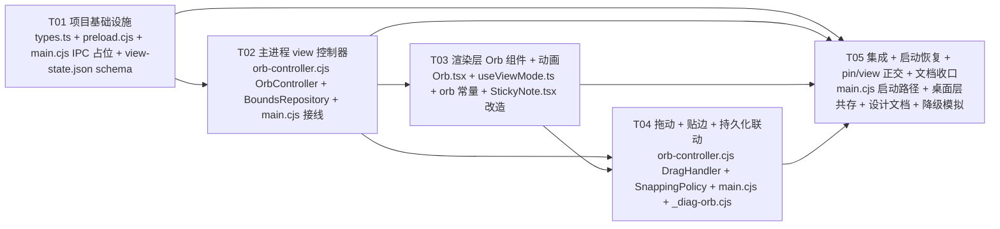

# GlassMemo 系统设计文档 — Orb Mode 增量（v1.1.0 · 悬浮球形态）

> 角色：Architect 高见远（Bob）
> 范围：**仅针对"完整便签 ↔ 悬浮球"形态切换功能**的增量设计，不重写现有 PRD / 桌面嵌入方案 / 窗口置顶设计。
> 基线：本文档为 `docs/system_design.md`（v1.0.0 · Desktop Widget 形态）的增量补丁，所有未被本文档显式覆盖的架构决策均沿用基线文档。
> 关系声明：本文档与既有 `docs/system_design.md` **并存且独立**——
> - 既有 system_design.md 负责「桌面挂件 ↔ 浮窗置顶」模式（pin 维度）
> - 本文档负责「完整便签 ↔ 悬浮球」模式（view 维度）
> - 两者在主进程 `main.cjs` 中通过 `LayerController`（pin 维度，已存在）+ `OrbController`（view 维度，本文新增）正交共存，互不重写

---

## Part A — 系统设计

### A.1 Implementation Approach（核心难点与对策）

#### 难点 1：同一 BrowserWindow 在 note / orb 两种形态间切换 bounds/frame/min-size，避免重建窗口

- **现状**：基线 system_design.md 已固定 `LayerController` 通过 `applyLayer()` 在同一 `BrowserWindow` 上做 `SetParent ↔ setAlwaysOnTop` 切换（不重建窗口）。本次新增「view 形态切换」必须**沿用同一原则**——不调用 `win.destroy()` / `win.close()` / 重建 `BrowserWindow`，否则会丢失：(a) 已建立好的桌面层 SetParent 状态、(b) `alwaysOnTop` 状态、(c) `pin:change` 订阅者、(d) 渲染层 React 组件树。
- **对策**：
  1. view 切换 = **bounds 改 + minSize 改 + resizable 改 + 渲染层条件渲染**的纯状态机操作，不动窗口 handle / 不重建 DOM 根。
  2. bounds 切换顺序固定为：**保存当前形态 bounds → 计算目标形态 bounds（从 `BoundsRepository` 读）→ `win.setMinimumSize()` → `win.setResizable()` → `win.setBounds()` → `webContents.send('view:change', …)`**。
  3. 形态切换完成后才允许下一轮切换（互斥锁），避免快速连点造成的中间态。

#### 难点 2：IPC 双向流（渲染 → 主 → 渲染）的一致性

- **现状**：基线已有单向 `pin:toggle`（渲染 → 主）+ 单向 `pin:change`（主 → 渲染）。本次新增 `view:toggle` / `view:get` / `view:change` 沿用同模式。
- **对策**：
  1. **请求方向**：`view:toggle` 由渲染进程触发（右上角缩小按钮 / 悬浮球点击 / 拖动结束），主进程在 `OrbController.toggle()` 内完成状态切换。
  2. **通知方向**：`view:change` 由主进程在 `win.setBounds()` **之后**推送，让动画基于「bounds 已真实变化」启动（SK-4 决策）。
  3. **去抖**：渲染层点击事件 200ms 节流，避免 AC-18 描述的快速点击场景下主进程事件队列堆积。

#### 难点 3：悬浮球可拖动 vs 可点击的冲突

- **现状**：基线 system_design §A.1 未涉及窗口内拖动；默认 `frame: false` 时 `-webkit-app-region: drag` 会让整个窗口成为拖动手势区，**但**会吞掉 React 的 click / dblclick 事件，无法在悬浮球上做"单击展开"。
- **对策**：
  1. **拖动用主进程而不是 CSS drag**——渲染层只负责捕获 `mousedown / mousemove / mouseup` 的位移增量，通过 IPC `view:drag` 把增量推送给主进程 `DragHandler`，由主进程调用 `win.setBounds()` 实现真实移动。
  2. 渲染层 `mousedown` 上挂一个 4px 阈值的小移动检测：移动 < 4px 视为点击（触发 `view:toggle`），移动 ≥ 4px 进入拖动模式。这样单击 / 双击 / 拖动在同一事件流上不冲突。
  3. 主进程 `DragHandler` 拥有「开始拖动 / 拖动中 / 拖动结束」三态，结束事件触发 `SnappingPolicy.apply()` + `BoundsRepository.save('orb', …)`。

#### 难点 4：贴边吸附（释放时 ≤30px 自动贴边）

- **现状**：PRD AC-11 要求悬浮球释放时若距屏幕左/右边缘 ≤ 30px，自动贴到该边缘。
- **对策**：
  1. `SnappingPolicy` 是纯函数（输入 = 当前 bounds + 显示区 workArea，输出 = 吸附后的 bounds），便于单元测试与纯函数复用。
  2. 吸附阈值常量 `SNAP_THRESHOLD = 30`、吸附后中心距边缘 `SNAP_INSET = 8`、悬浮球尺寸常量 `ORB_SIZE = 60` 全部提到 `src/constants/orb.ts`，不在代码里硬编码。
  3. 吸附时机 = `mouseup` 事件触发的主进程 `drag:end` 回调，**先**贴边、**再**持久化到 `orb-bounds.json`，避免"贴边后位置没保存"导致下次启动反弹。

#### 难点 5：两份 bounds 持久化的不互相覆盖

- **现状**：基线已有 `userData/window-bounds.json`（note 模式）。本次新增 `userData/orb-bounds.json`（orb 模式）。
- **对策**：
  1. `BoundsRepository` 用**文件级隔离**而非单文件多 key：两个文件互不感知，避免「缩小前写 note-bounds、缩小后又写 orb-bounds、展开时读 note-bounds」的写入竞争。
  2. 写入策略：note → orb 切换时**先**写 `note-bounds.json`（保存当前形态），**再**切形态、**最后**让 orb 拖动时再写 `orb-bounds.json`（懒写）。
  3. 启动恢复时按 `userData/view-state.json`（**新增第三个文件**）记录的 `lastView` 字段决定读哪份 bounds——避免「上次关在 orb，本次启动却按 note-bounds 显示」。

---

### A.2 File List（增量）

> 标注：✅ = 已存在（约束，不重设计，沿用） · 🆕 = 本次新增 / 修改

#### 主进程（Electron）

- ✅ `electron/main.cjs` — **修改点**：新增 `OrbController` 持有、`view:toggle` / `view:change` IPC 注册、托盘菜单新增「折叠为悬浮球」、启动时按 `lastView` 恢复。
- ✅ `electron/desktop-layer.cjs` — **不动**（pin 维度与 view 维度正交，桌面嵌入继续生效）。
- ✅ `electron/preload.cjs` — **修改点**：`contextBridge` 新增 `view.toggle()` / `view.get()` / `view.onChange(cb)` / `view.drag(delta)`。
- 🆕 `electron/orb-controller.cjs` — 主进程 view 控制器：`OrbController` 类（toggle / shrink / expand / getState）+ `BoundsRepository` 类（note/orb 双文件持久化）+ `DragHandler` 类（主进程拖动事件）+ `SnappingPolicy` 纯函数模块。
- ✅ `electron/_diag.cjs` — **不动**。

#### 渲染进程（React）

- ✅ `src/components/StickyNote.tsx` — **修改点**：右上角标题栏在「窗口置顶」与「关闭到托盘」按钮**之间**新增「缩小」按钮；新增 view 形态条件渲染分支（`view === 'note'` 渲染既有便签，`view === 'orb'` 渲染 `<Orb />`）。
- 🆕 `src/components/Orb.tsx` — 悬浮球 UI 组件：60×60 圆形 + 居中发光便签 SVG + hover scale 1.05 + mousedown/move/up 拖动事件（节流后通过 IPC 推位移）。
- 🆕 `src/hooks/useViewMode.ts` — 订阅 `view:change`，将 `view` / `bounds` 暴露给组件（与基线 `usePin` 风格一致）。
- 🆕 `src/constants/orb.ts` — `ORB_SIZE = 60` / `SNAP_THRESHOLD = 30` / `SNAP_INSET = 8` / `ANIMATION_DURATION_MS = 250`。
- ✅ `src/types.ts` — **修改点**：新增 `ViewMode = 'note' | 'orb'`、`ViewState`、`OrbPosition`、`Bounds` 复用既有类型。
- ✅ `src/styles/globals.css` — **不动**（沿用 glassdemo 暗色霓虹毛玻璃风格）。

#### 构建 / 打包

- ✅ `electron-builder.yml` — **不动**（view 形态切换不引入新依赖，不影响 asarUnpack）。
- ✅ `package.json` — **不动**（不引入新依赖）。

#### 文档（本次新增）

- ✅ `docs/prd-orb.md` — PM 刚产出（输入文件，不重写）。
- ✅ `docs/system_design.md` — 基线（v1.0.0，不重写）。
- 🆕 `docs/system_design-orb.md` — **本文件**（Architect 增量产出）。
- 🆕 `docs/class-diagram-orb.mermaid` — classDiagram（仅覆盖新增 / 扩展类型）。
- 🆕 `docs/sequence-diagram-orb.mermaid` — sequenceDiagram（覆盖 4 个核心场景）。

---

### A.3 Data Structures & Interfaces

> 完整 UML 见 `docs/class-diagram-orb.mermaid`。下面给出关键 contract 草图。

#### 渲染进程侧（types.ts 增量）

```ts
// src/types.ts 增量
export type ViewMode = 'note' | 'orb';

export interface Bounds {
  x: number;
  y: number;
  width: number;
  height: number;
}

export interface ViewState {
  view: ViewMode;          // 当前形态
  bounds: Bounds;          // 当前形态的窗口 bounds
  isAnimating: boolean;    // 是否正在切换动画中（用于禁用快速点击）
}

// 与既有 PinState 正交，组合后构成完整 UI 状态
export interface AppState {
  pin: { pinned: boolean; mode: 'desktop-widget' | 'pinned-floating' | 'normal-fallback' };
  view: ViewState;
}

// IPC 推送载荷
export interface ViewChangePayload {
  from: ViewMode;
  to: ViewMode;
  bounds: Bounds;          // 切换完成后的真实 bounds（SK-4：setBounds 之后推送）
  isAnimating: boolean;
}

// 渲染层拖动 IPC 载荷
export interface OrbDragDelta {
  dx: number;              // 相对上一次的位移
  dy: number;
  phase: 'start' | 'move' | 'end';
}
```

#### 主进程侧（orb-controller.cjs 新增）

```js
// electron/orb-controller.cjs
class OrbController {
  private win: BrowserWindow;
  private currentView: 'note' | 'orb';
  private currentBounds: Bounds;
  private isAnimating: boolean;

  constructor(win: BrowserWindow, repo: BoundsRepository) { … }

  // 由 IPC view:toggle 触发；from 渲染进程
  toggle(source: 'button' | 'orb-click' | 'tray'): ViewState;

  // 内部状态机方法
  shrink(): Promise<ViewState>;    // note → orb：保存 note-bounds → 切 orb
  expand(): Promise<ViewState>;    // orb → note：从 note-bounds 读回 → 切 note

  // 由 view:get IPC 触发
  getState(): ViewState;
}

class BoundsRepository {
  // 文件路径：userData/note-bounds.json / userData/orb-bounds.json / userData/view-state.json
  saveNote(bounds: Bounds): Promise<void>;
  saveOrb(bounds: Bounds): Promise<void>;
  loadNote(): Promise<Bounds | null>;
  loadOrb(): Promise<Bounds | null>;
  saveLastView(view: ViewMode): Promise<void>;
  loadLastView(): Promise<ViewMode | null>;
}

class DragHandler {
  private startBounds: Bounds;
  private isDragging: boolean;

  // 由 IPC view:drag 触发（phase: 'start' | 'move' | 'end'）
  onDrag(payload: OrbDragDelta, win: BrowserWindow, snap: SnappingPolicy, repo: BoundsRepository): void;
}

// 纯函数模块（便于测试）
const SnappingPolicy = {
  SNAP_THRESHOLD: 30,
  SNAP_INSET: 8,
  ORB_SIZE: 60,

  // 输入当前 bounds + display.workArea，输出吸附后 bounds
  apply(bounds: Bounds, workArea: { x: number; y: number; width: number; height: number }): Bounds;

  // 把 bounds 限制在 workArea 内（多屏拼接安全）
  clampToWorkArea(bounds: Bounds, workArea: { … }): Bounds;
};

// electron/preload.cjs 增量
interface ViewApi {
  view: {
    toggle(source?: 'button' | 'orb-click' | 'tray'): Promise<ViewState>;
    get(): Promise<ViewState>;
    onChange(cb: (payload: ViewChangePayload) => void): () => void;
    drag(delta: OrbDragDelta): Promise<void>;   // 由 Orb 组件 mousedown/move/up 调用
  };
}

// 与基线 IpcBridge 合并后构成完整 window.glassmemo
declare global {
  interface Window {
    glassmemo: IpcBridge & ViewApi;
  }
}
```

---

### A.4 Program Call Flow（核心调用链）

> 完整时序图见 `docs/sequence-diagram-orb.mermaid`。下面是文字版（4 个场景）。

#### 场景 1：用户点右上角「缩小」按钮 → shrink → win.setBounds → orb 渲染

1. 用户在 `StickyNote` 标题栏点击「缩小」按钮（位置：在「窗口置顶」与「关闭到托盘」之间）。
2. `StickyNote` 调用 `window.glassmemo.view.toggle('button')` → IPC `view:toggle`。
3. 主进程 `OrbController.toggle()` 读取 `currentView === 'note'` → 调用 `shrink()`。
4. `shrink()`：
   a. `BoundsRepository.saveNote(currentBounds)` —— 保存完整便签当前 bounds 到 `userData/note-bounds.json`。
   b. `BoundsRepository.saveLastView('orb')` —— 写入 `userData/view-state.json`。
   c. `win.setMinimumSize(60, 60)` + `win.setResizable(false)`。
   d. 计算 orb 目标 bounds = `SnappingPolicy.clampToWorkArea(currentBounds 中心点对齐到 60×60, display.workArea)`。
   e. `win.setBounds(targetBounds)`。
   f. `webContents.send('view:change', { from: 'note', to: 'orb', bounds: targetBounds, isAnimating: true })`。
5. 渲染层 `useViewMode` 收到推送 → `setState({ view: 'orb', bounds: targetBounds, isAnimating: true })`。
6. `StickyNote` 根据 `view === 'orb'` 渲染 `<Orb />` 分支；Motion 12 在 250ms 内做缩放过渡。
7. 动画结束 → `setState({ isAnimating: false })`。

#### 场景 2：用户点悬浮球 → expand → win.setBounds → note 渲染

1. 用户在悬浮球上点击（mousedown → mouseup 位移 < 4px，判定为点击）。
2. `Orb.tsx` 调用 `window.glassmemo.view.toggle('orb-click')` → IPC `view:toggle`。
3. 主进程 `OrbController.toggle()` 读取 `currentView === 'orb'` → 调用 `expand()`。
4. `expand()`：
   a. `BoundsRepository.saveOrb(currentBounds)` —— 保存当前 orb 位置（如果用户拖过）。
   b. `BoundsRepository.loadNote()` —— 读 `note-bounds.json`，得到缩小前的 bounds。
   c. `BoundsRepository.saveLastView('note')`。
   d. `win.setMinimumSize(200, 200)` + `win.setResizable(true)`（恢复可调整大小）。
   e. `win.setBounds(savedNoteBounds)`。
   f. `webContents.send('view:change', { from: 'orb', to: 'note', bounds: savedNoteBounds, isAnimating: true })`。
5. 渲染层收到推送 → 切换回 `view === 'note'` 分支 → 既有便签 UI 重新可见 → 250ms 缩放动画。

#### 场景 3：用户拖动悬浮球 → DragHandler 计算新 bounds → 释放时 SnappingPolicy → 持久化

1. 用户在悬浮球上 `mousedown` → 位移 > 4px → 进入拖动模式。
2. `Orb.tsx` 拦截 mousemove，节流后调用 `window.glassmemo.view.drag({ dx, dy, phase: 'move' })` → IPC `view:drag`。
3. 主进程 `DragHandler.onDrag(phase='move')`：
   a. `newBounds = { x: currentBounds.x + dx, y: currentBounds.y + dy, width: 60, height: 60 }`。
   b. `newBounds = SnappingPolicy.clampToWorkArea(newBounds, display.workArea)` —— 多屏安全裁剪。
   c. `win.setBounds(newBounds)`（移动过程视觉跟手）。
   d. **不**推送 `view:change`（避免触发动画）；**不**持久化（拖动过程中频繁写盘浪费）。
4. 用户 `mouseup` → `Orb.tsx` 调 `window.glassmemo.view.drag({ dx: 0, dy: 0, phase: 'end' })`。
5. 主进程 `DragHandler.onDrag(phase='end')`：
   a. `SnappingPolicy.apply(currentBounds, display.workArea)` —— 贴边吸附（阈值 30px，贴边后中心距 8px）。
   b. `win.setBounds(snappedBounds)`。
   c. `BoundsRepository.saveOrb(snappedBounds)` —— 持久化到 `orb-bounds.json`。
6. 用户拖完，悬浮球停留在吸附后位置。

#### 场景 4：启动恢复 → 按 `view-state.json.lastView` 选择 note 或 orb

1. `app.whenReady()` → 创建 `BrowserWindow`（参数与基线一致：frameless + transparent + alwaysOnTop=false）。
2. 加载 React 应用。
3. `win.once('ready-to-show', …)` 触发 → 主进程调用 `BoundsRepository.loadLastView()` 读 `view-state.json`。
4. 若 `lastView === 'orb'`：
   a. `OrbController` 初始化 `currentView = 'orb'`，`currentBounds = BoundsRepository.loadOrb()`（若文件不存在则用默认居中 60×60）。
   b. `win.setMinimumSize(60, 60)` + `win.setResizable(false)` + `win.setBounds(currentBounds)`。
   c. `webContents.send('view:change', { from: 'note', to: 'orb', bounds: currentBounds, isAnimating: false })`。
   d. `applyLayer({ pinned: lastPinned })` 继续生效（pin 与 view 正交）。
5. 若 `lastView === 'note'`（含首次启动默认）：
   a. `currentView = 'note'`，`currentBounds = BoundsRepository.loadNote()`（默认 360×480 居中）。
   b. 走基线 system_design.md 的 `applyLayer({ pinned: false })` 桌面嵌入流程。
6. 渲染层 `useViewMode` 拿到 `view` 后条件渲染。

---

### A.5 Anything UNCLEAR（Open Questions）

1. **悬浮球双击展开 vs 单击展开**：PRD §3.2 P1 提到「双击悬浮球 = 展开」，但单击也可展开。是否在桌面交互中真的需要双击支持？若单击已经覆盖 90% 场景，双击可能反而误触（拖动结束时的双击抖动）。**建议**：实现双击作为冗余入口，但不优先做 UI 提示，由 QA 在 AC-8 验证时确认是否可去掉。
2. **贴边阈值 30px 是否合适**：PRD AC-11 写 ≤ 30px，但桌面 DPI 缩放（125% / 150%）下，30px 实际物理距离会变小。**建议**：阈值用逻辑像素（Electron 默认 logical pixel），并提供 `SNAP_THRESHOLD` 常量便于后续用户反馈后调整。
3. **动画时长 250ms vs 用户期望**：PRD P2 提到默认 250ms，但 AC-2 / AC-5 写的是 200–300ms。**建议**：默认 250ms，可通过 `ANIMATION_DURATION_MS` 常量调节；Engineer 实现时若实测卡顿再回调。
4. **拖动时是否禁用 React 内部指针事件**：悬浮球内部有 hover / active 微动画（scale 1.05），拖动过程中是否应禁用？**建议**：拖动开始（phase='start'）时通过 `data-dragging="true"` 属性让 `<Orb />` 内部禁用 transition；拖动结束恢复。
5. **orb 模式与桌面层嵌入的边界关系**：PRD AC-13 要求 orb 模式仍嵌入 WorkerW。但 Win32 `SetParent` 对 60×60 的窗口嵌入是否会有 Z-order 异常？**建议**：orb 模式继续走 `applyLayer()`，由基线 system_design.md 的降级路径兜底；若发现 orb 嵌入后 z-order 抖动，由 Engineer 在 T05 阶段加专门回归测试。

---

## Part B — 任务分解（硬上限 5）

### B.1 Required Packages

> **不引入新依赖**。本次新增 view 切换功能完全沿用现有依赖。

- `electron@^33.2.0`（主进程 + 打包）
- `react@^19` / `react-dom@^19`（UI）
- `motion@^12`（悬浮球缩放 / 展开动画）
- `tailwindcss@^4`（暗色霓虹毛玻璃样式）
- `vite@^6`（构建）
- `koffi@^3.2.1`（仅 pin 维度使用，本次不直接调用）

> **不引入**：
> - 任何窗口管理库（如 `electron-window-state`）—— `BoundsRepository` 直接用 `fs/promises` 读写 JSON 即可
> - 任何拖动手势库（如 `react-draggable`）—— 4px 阈值 + 主进程 `setBounds` 拖动足够，引入第三方反而和 React 事件冲突
> - 任何多屏管理库（如 `electron-screen`) —— `screen.getDisplayNearestPoint` 已内置

### B.2 Task List（按依赖排序，分组原则 = 模块/层次）

> 每任务 ≥ 3 个相关文件。

#### T01 — 项目基础设施（类型 + 入口扩展 + 持久化 schema）

**目标**：把 view 形态切换的所有"非业务"基础打好——类型声明、preload 暴露、持久化 schema、托盘入口扩展——为后续主进程控制器与渲染组件铺路。

**涉及文件**：
- `src/types.ts`（新增 `ViewMode` / `Bounds` / `ViewState` / `AppState` / `ViewChangePayload` / `OrbDragDelta`）
- `electron/preload.cjs`（`contextBridge` 暴露 `window.glassmemo.view.{toggle, get, onChange, drag}`）
- `electron/main.cjs`（新增托盘菜单项「折叠为悬浮球」入口、注册 `view:toggle` / `view:change` / `view:drag` IPC 占位 + `view-state.json` 加载占位）
- 🆕 `userData/view-state.json` schema 文档注释（写到 main.cjs 注释里，描述 `lastView` 字段）

**验收**：`npm run build` 通过；TypeScript 类型 `Window['glassmemo']['view']` 可在 IDE 自动补全；IPC 占位注册不报 `ipcMain.handle` 未注册错误。

**依赖**：无（最底层任务，与基线 T01 正交）。

---

#### T02 — 主进程 view 控制器 + 双形态持久化（OrbController + BoundsRepository）

**目标**：在主进程落地 view 形态的状态机与双 bounds 持久化，让后续渲染层只需要订阅推送、不需要关心状态来源。

**涉及文件**：
- 🆕 `electron/orb-controller.cjs`（导出 `OrbController` 类：`toggle / shrink / expand / getState`，内部维护 `currentView` / `currentBounds` / `isAnimating`）
- 🆕 `electron/orb-controller.cjs`（导出 `BoundsRepository` 类：`saveNote / saveOrb / loadNote / loadOrb / saveLastView / loadLastView`，基于 `fs/promises` + `path.join(app.getPath('userData'), …)`）
- `electron/main.cjs`（require `orb-controller.cjs`、`new OrbController(win, repo)`、把 T01 的 IPC 占位接到真实控制器方法上）
- `electron/preload.cjs`（微调 IPC handler 转发，与 T01 的 contextBridge 暴露对齐）

**验收**：`npm run electron:dev` 启动后，控制台打印 `[orb-controller] initialized`；手工触发 IPC `view:toggle` 能在主进程日志看到 `[orb-controller] toggle from 'note' to 'orb'`；`userData/note-bounds.json` 与 `userData/orb-bounds.json` 在切换时被正确读写。

**依赖**：T01。

---

#### T03 — 渲染层 Orb 组件 + useViewMode hook + 缩放动画

**目标**：在渲染层落地 view 条件渲染的两个分支（既有 `<StickyNote>` + 新增 `<Orb>`），并接好 IPC，让用户视觉上能看到形态切换。

**涉及文件**：
- 🆕 `src/components/Orb.tsx`（60×60 圆 + 居中便签 SVG + hover scale 1.05 + mousedown/move/up 事件 + 节流 + 4px 点击/拖动判定）
- 🆕 `src/hooks/useViewMode.ts`（订阅 `view:change`，暴露 `{ view, bounds, isAnimating }`，与基线 `usePin` 风格对齐）
- 🆕 `src/constants/orb.ts`（`ORB_SIZE = 60` / `SNAP_THRESHOLD = 30` / `SNAP_INSET = 8` / `ANIMATION_DURATION_MS = 250` / `DRAG_CLICK_THRESHOLD_PX = 4`）
- `src/components/StickyNote.tsx`（新增右上角「缩小」按钮，位于「窗口置顶」与「关闭到托盘」之间；view === 'orb' 时整个组件树替换为 `<Orb />`；Motion 12 实现 250ms 缩放过渡）

**验收**：点击「缩小」按钮看到窗口在 ~250ms 内收缩成 60×60 圆；圆上 hover 看到 scale 1.05；AC-1 ~ AC-4 视觉验收通过。

**依赖**：T01 + T02。

---

#### T04 — 主进程 DragHandler + SnappingPolicy + 持久化联动

**目标**：让悬浮球真正可拖动、贴边吸附、拖动结束持久化，把"orb 可用"做到完整。

**涉及文件**：
- 🆕 `electron/orb-controller.cjs`（追加 `DragHandler` 类：`onDrag(payload, win, snap, repo)`，phase='start' 记录初始 bounds，phase='move' 计算 newBounds + clamp + setBounds，phase='end' 触发 SnappingPolicy.apply + repo.saveOrb）
- 🆕 `electron/orb-controller.cjs`（追加 `SnappingPolicy` 纯函数：`apply(bounds, workArea)` + `clampToWorkArea(bounds, workArea)`，纯函数无副作用，便于单测）
- `electron/main.cjs`（把 T02 的 `view:drag` IPC handler 接到 `DragHandler.onDrag`；注入 `screen.getDisplayNearestPoint` 的 workArea）
- 🆕 `electron/_diag-orb.cjs`（诊断脚本：枚举当前 display + 工作区，打印 `[orb] display.workArea = {x, y, w, h}` + `SnappingPolicy.apply` 单元自测）

**验收**：拖动悬浮球到屏幕左 / 右 ≤ 30px 释放，吸附到该边缘；多屏拼接环境（扩展屏）拖动不被卡住；关闭再打开位置保留（AC-9 ~ AC-12 通过）。

**依赖**：T02 + T03（T03 提供 IPC 推送链路，T02 提供 repo / 控制器）。

---

#### T05 — 集成、与基线 pin 维度的正交共存、启动恢复与文档收口

**目标**：把 view 维度和 pin 维度在 `main.cjs` 里串起来；保证 orb 模式仍嵌入 WorkerW（基线桌面层语义保持）；把启动恢复路径跑通；把所有 AC 在开发态验证一遍。

**涉及文件**：
- `electron/main.cjs`（启动恢复路径：读 `view-state.json` → 选 note / orb → 设置对应 bounds → 调用 `applyLayer({ pinned: lastPinned })`；orb 模式下 minSize=60×60 + resizable=false；note 模式下恢复 minSize=200×200 + resizable=true）
- `electron/desktop-layer.cjs`（不动文件，但在 main.cjs 调用处加注释：orb 模式仍走 `applyLayer`，与基线共用一份 FFI 桥）
- `docs/system_design-orb.md` / `docs/class-diagram-orb.mermaid` / `docs/sequence-diagram-orb.mermaid`（本套设计文档，作为 Engineer / QA / 后续维护的基线；T05 收口时把 A.5 的 Open Questions 状态更新）
- `electron/_diag-orb.cjs`（在 T04 基础上加「嵌入失败模拟」分支：人为把 WorkerW 句柄传 0，验证 orb 模式下桌面层降级路径不崩）

**验收**：AC-13（orb 模式仍嵌入 WorkerW）/ AC-14（pinned 状态横跨 view 切换保持）/ AC-15（缩小后点 X 仍隐藏到托盘）/ AC-16（视觉延续）/ AC-17（动画时长）/ AC-18（快速点击不崩）全部通过。

**依赖**：T01–T04 全部完成。

---

### B.3 Shared Knowledge（跨切关注点）

#### SK-1 · view 切换不重建 BrowserWindow

- **唯一原则**：view 形态切换 = bounds + minSize + resizable + 渲染层条件渲染的纯状态机操作，**绝不**调用 `win.destroy()` / `win.close()` / 重建 `BrowserWindow`。
- **原因**：(a) 已建立好的桌面层 SetParent 状态会丢失，需要重新走 `applyLayer`；(b) `pin:change` 订阅者会被清理；(c) 渲染层 React 组件树会重新挂载，丢失便签编辑器内部 state。
- **后果**：view 切换必须能容忍同一窗口 handle 下"frame 变了"的情况，确保 koffi 已有的 `hwndBuffer` 仍然有效（窗口 handle 在生命周期内不变）。

#### SK-2 · win.setBounds 必须在桌面层可干预时序内执行

- **顺序**：orb 模式下需要 `setMinimumSize(60,60) + setResizable(false)` **先于** `setBounds`，避免窗口系统尝试用 note 尺寸的 minSize 约束新 orb bounds。
- **alwaysOnTop**：view 切换**不**修改 `setAlwaysOnTop`——pin 维度与 view 维度正交，`alwaysOnTop` 由 `LayerController`（基线）单独管理。
- **SetParent**：view 切换**不**调用 `SetParent`——`SetParent` 由基线 `applyLayer()` 单独管理，view 切换只触发 bounds / minSize 变化。
- **错误处理**：`setBounds` 失败 → `console.error('[orb-controller] setBounds failed: <reason>')` + 不抛错（继续后续 IPC 推送，由渲染层基于「动画失败但状态已切」显示警告）。

#### SK-3 · note 与 orb 的 min/max size 切换

| 维度 | note 模式 | orb 模式 |
| --- | --- | --- |
| minSize | 200 × 200 | 60 × 60 |
| maxSize | `screen.getPrimaryDisplay().workArea` 等比例上限 | 不设（固定 60×60） |
| resizable | true | false |
| frame | frameless（沿用基线） | frameless |
| movable | true（基线允许） | true（拖动通过 IPC） |
| fullscreenable | false（基线禁止） | false |

- **切换时机**：`shrink()` 第一步 `setMinimumSize(60,60) + setResizable(false)`；`expand()` 第一步 `setMinimumSize(200,200) + setResizable(true)`。原因：必须先放宽约束再 setBounds，否则可能因 minSize > target 抛 `ERR_BOUNDS_NOT_MEET_MIN`。

#### SK-4 · view:change 推送时机 = setBounds 之后

- **决策**：`webContents.send('view:change', payload)` 必须发生在 `win.setBounds()` **之后**。
- **原因**：让动画基于「bounds 真实变化」启动，避免「动画启动 → setBounds 失败 → 动画跳变」的不一致体验。
- **渲染层**：收到 `view:change` 后立即 `setState({ view, bounds, isAnimating: true })`，250ms 动画结束（Motion `onAnimationComplete`）后 `setState({ isAnimating: false })`。
- **拖动时例外**：`view:drag` phase='move' 期间**不**推送 `view:change`（避免动画与拖动竞争），只通过 `win.setBounds` 实时跟手；phase='end' 时也不推送 `view:change`（bounds 变了但 view 仍是 'orb'）。

#### SK-5 · 两份 bounds 持久化的写入纪律

- **note-bounds.json**：仅在 `shrink()` 触发时写入（保存当前 note bounds），**不**在 `expand()` 时写入（避免把 orb 的小 bounds 误写进 note-bounds）。
- **orb-bounds.json**：仅在 `DragHandler.onDrag(phase='end')` 与 `expand()` 触发时写入（保存当前 orb bounds 或即将展开前的 orb bounds）。
- **view-state.json**：`shrink()` / `expand()` / 启动恢复时写入或读取，记录 `lastView`。
- **互斥**：`saveNote` 与 `saveOrb` 不并发调用（同一 `BoundsRepository` 实例串行化，async queue）。
- **错误处理**：文件读写失败 → `console.error('[bounds-repository] <reason>')` + 不抛错（保证 UI 不卡死，启动恢复时回退到默认居中 bounds）。

---

### B.4 Task Dependency Graph



---

> 文档版本：v1.1.0 · 角色：Architect 高见远（Bob）
> 与 `docs/system_design.md`（v1.0.0）并存且正交；本文档只覆盖 view 维度，pin 维度的所有决策沿用基线。
> 与 `docs/prd-orb.md` 配套，作为后续 Engineer / QA 工作的基线。