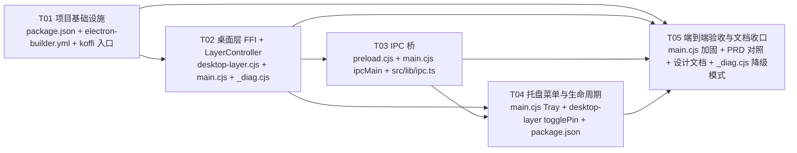

# GlassMemo 系统设计文档（v1.0.0 · Desktop Widget 形态）

> 角色：Architect 高见远（Bob）
> 范围：把现有 Electron 便签改造为真正的 Windows 桌面挂件，默认嵌入 Progman → WorkerW 桌面层，托盘可切换「桌面挂件 ↔ 浮窗置顶」。
> 约束：沿用已落地的 Electron 33 + React 19 + Vite 6 + Tailwind 4 + Motion 12 + koffi 3.2.1，不重新设计已有架构。

---

## Part A — 系统设计

### A.1 Implementation Approach（核心难点与对策）

#### 难点 1：Win32 `SetParent` 在 Electron 运行时是否真的生效（沙箱无法验）

- **现状**：Windows 桌面树通过 koffi 已实测枚举（`Progman → { SHELLDLL_DefView, WorkerW(空) }`），但 Electron 主进程在 Chromium GPU 沙箱 + 渲染进程隔离下调用 Win32 API 的实际表现，CI / 沙箱环境无法验证。
- **对策**：
  1. `applyLayer()` 必须在 `win.once('ready-to-show', …)` 之后再触发，避免 `win.getNativeWindowHandle()` 在窗口尚未就绪时返回无效 Buffer。
  2. 调用顺序固定为 `findDesktopWorkerW()` → `SetParent(winHwnd, workerW)` → 失败则 `console.error` + `detachFromDesktop()` + 不抛错。
  3. 提供 `_diag.cjs` 诊断脚本（PRD §3.2 P2），把桌面树快照打印到 stdout，方便用户在嵌入异常时自查。
  4. PRD 已声明 Open Question #1，需用户本机一次启动验证；Agent 不能代验。

#### 难点 2：`Buffer` 作为 `void*` 跨 FFI 的正确性

- **现状**：`win.getNativeWindowHandle()` 返回 `Buffer`，koffi 期望 `Buffer | BigInt` 形式的指针。Electron 33 在不同 Windows 架构下 Buffer 长度可能是 4 字节（HWND 32 位视图）或 8 字节（`HWND` 实际是 `LONG_PTR`，64 位下 8 字节）。
- **对策**：
  1. **不直接传 Buffer 给 koffi 的 `void*`**，而是用 `koffi.address(buf)` / `koffi.pointer(buf)` 包一层（koffi 3.x 的对外约定），避免 Buffer 内部二进制被当成普通 number 拷贝。
  2. 在 `desktop-layer.cjs` 内部对 `hwndBuffer` 做长度校验：`Buffer.isBuffer(h) && h.length >= 4 && h.length <= 8`，否则抛 `InvalidHwndBufferError` 并被 `applyLayer()` 捕获降级。
  3. 出口统一通过 `applyLayer({ pinned, hwnd: win.getNativeWindowHandle() })` 把 Buffer 传进去，不让调用方直接接触 koffi。

#### 难点 3：WorkerW 选择策略

- **现状**：桌面树实测 Progman 有直接子 WorkerW（用于嵌入），顶层另有 14 个其它程序的 WorkerW。
- **对策**：`findDesktopWorkerW()` 按 **Progman 直接子 + className === 'WorkerW' + 父链确实是 Progman** 三条件联合过滤，**不**用 `EnumWindows` 全局枚举后取第一个（避免挂到 VS Code / Chrome 自己的 WorkerW 上）。
- 备选：若 Progman 直接子中没有可用的 WorkerW（例如某些自定义主题/壁纸引擎接管了桌面），退化到「顶层 SHELLDLL_DefView 父链」搜一次，再失败就降级。

#### 难点 4：嵌入失败降级（不能崩）

- **现状**：PRD §3.1 P0 明确要求「嵌入失败 → 普通可拖拽窗口，不闪退不卡死」。
- **对策**：
  1. `applyLayer()` 整体包一层 try/catch，所有 Win32 调用（`FindWindowW` / `SetParent` / `SendMessageTimeoutW`）失败 → `console.error('[desktop-layer] <原因>')` → `detachFromDesktop()` 兜底 → 不调用 `win.destroy()` / `app.quit()`。
  2. 降级路径必须保证主窗口仍是「无边框 + 可拖拽 + 透明度可调」的现有形态，AC-11/12/13 不破。
  3. 失败原因同步到托盘 `tooltip`（PRD §3.2 P2），让用户在不打开 DevTools 时也能识别。

#### 难点 5：`asarUnpack` 解包 koffi 原生 `.node`

- **现状**：`electron-builder.yml` 已加 `asarUnpack: ['node_modules/**/*.node']`。
- **对策**：
  1. 打包后验证 `resources/app.asar.unpacked/node_modules/**/koffi/**` 下存在 `.node`（AC-18）。
  2. 在 `desktop-layer.cjs` 顶部 require koffi 时不要用 `require('koffi/src/...')` 这类深层路径，统一 `require('koffi')`，由 electron-builder 自动解包。
  3. Open Question #4（非管理员权限加载 .node）—— 已通过 asarUnpack 路径位于用户可写目录解决，但需用户本机一次验证。

---

### A.2 File List（涉及文件清单）

> 标注：✅ = 已存在（约束，不重设计） · 🆕 = 本 PR 新增文档

#### 主进程（Electron）

- ✅ `electron/main.cjs` — 应用入口、`BrowserWindow` 创建、`applyLayer()` 调用、托盘菜单、`pin:toggle` IPC、生命周期。
- ✅ `electron/desktop-layer.cjs` — Win32 FFI 封装：`findDesktopWorkerW()` / `attachToDesktop(hwndBuffer)` / `detachFromDesktop(hwndBuffer)`。
- ✅ `electron/tray.cjs`（若已拆分；未拆分则在 `main.cjs` 内）— 托盘菜单构建、`pin:toggle` checkbox 状态绑定、`tooltip` 切换。
- ✅ `electron/preload.cjs` — `contextBridge` 暴露 `pin:toggle` / `pin:get` 到渲染进程。

#### 渲染进程（React）

- ✅ `src/main.tsx` / `src/App.tsx` — 既有毛玻璃便签 UI，本 PR 不动视觉。
- ✅ `src/components/PinToggle.tsx`（或类似）— UI 上的「置顶」按钮 → `window.glassmemo.pin.toggle()`。
- ✅ `src/styles/globals.css` — Tailwind 4 入口。

#### 构建 / 打包

- ✅ `electron-builder.yml` — `asarUnpack: ['node_modules/**/*.node']`。
- ✅ `package.json` — `dependencies.koffi@^3.2.1`、`electron@^33.2.0`、scripts：`electron:dev` / `dist`。
- ✅ `vite.config.ts` — React 19 + Vite 6 配置。

#### 诊断 / 文档（新增）

- 🆕 `docs/prd.md` — PRD（PM 产出）
- 🆕 `docs/system_design.md` — 本文件（Architect 产出）
- 🆕 `docs/class-diagram.mermaid` — 类图
- 🆕 `docs/sequence-diagram.mermaid` — 时序图
- 🆕 `electron/_diag.cjs` — 诊断脚本：枚举 Progman 子窗口 + 顶层 WorkerW。

---

### A.3 Data Structures & Interfaces（核心类型）

> 完整 UML 见 `docs/class-diagram.mermaid`。下面给出关键 contract 草图。

#### 主进程侧

```ts
// electron/desktop-layer.cjs
interface DesktopLayerBridge {
  findDesktopWorkerW(): bigint /* HWND */;
  attachToDesktop(hwndBuffer: Buffer): AttachResult;
  detachFromDesktop(hwndBuffer: Buffer): AttachResult;
}

interface AttachResult {
  ok: boolean;
  mode: 'desktop-widget' | 'pinned-floating' | 'normal-fallback';
  reason?: string; // 失败原因，降级时填写
}

// electron/main.cjs
interface LayerController {
  private win: BrowserWindow;
  private pinned: boolean;
  private lastMode: AttachResult['mode'];

  applyLayer(opts?: { pinned?: boolean }): Promise<AttachResult>;
  togglePin(): Promise<AttachResult>;
  getMode(): AttachResult['mode'];
}

// electron/preload.cjs
interface IpcBridge {
  pin: {
    toggle(): Promise<AttachResult>;
    get(): Promise<{ pinned: boolean; mode: AttachResult['mode'] }>;
    onChange(cb: (s: { pinned: boolean; mode: AttachResult['mode'] }) => void): () => void;
  };
}

// 来自渲染进程的调用契约
interface PinToggleRequest {
  source: 'tray' | 'ui-button';
  expectedPinned: boolean;
}
```

#### 渲染进程侧（消费契约）

```ts
// window.glassmemo 的 TypeScript 类型
declare global {
  interface Window {
    glassmemo: IpcBridge;
  }
}
```

---

### A.4 Program Call Flow（核心调用链）

> 完整时序图见 `docs/sequence-diagram.mermaid`。下面是文字版。

#### 场景 1：app 启动 → ready-to-show → applyLayer → attachToDesktop

1. `app.whenReady()` → 创建 `BrowserWindow`（frameless + transparent + alwaysOnTop=false）。
2. `win.loadURL(...)` 加载 React 应用。
3. `win.once('ready-to-show', …)` 触发 → `applyLayer({ pinned: false })`。
4. `LayerController.applyLayer()` 取 `win.getNativeWindowHandle()` → Buffer。
5. `findDesktopWorkerW()` → HWND（bigint）。
6. `attachToDesktop(hwndBuffer)` → koffi `SetParent(hwnd, workerW)`。
7. 成功：写入 `lastMode = 'desktop-widget'`，更新托盘 `tooltip` 为「桌面挂件」。
8. 失败：catch → `detachFromDesktop(hwndBuffer)` 兜底 → `lastMode = 'normal-fallback'` → 托盘 tooltip 带失败原因。

#### 场景 2：托盘点击「窗口置顶」 → applyLayer → detach + setAlwaysOnTop

1. 用户在托盘菜单勾选「窗口置顶」。
2. 托盘菜单回调 → `LayerController.togglePin()` → `applyLayer({ pinned: true })`。
3. `detachFromDesktop(hwndBuffer)`（SetParent 回 NULL / 0，等价于脱离 WorkerW）。
4. `win.setAlwaysOnTop(true, 'screen-saver')` 保证浮在最上（含全屏应用）。
5. `win.show()` / `win.focus()`，写入 `lastMode = 'pinned-floating'`，tooltip = 「浮窗置顶」。
6. 通过 `pin:change` IPC 通知渲染进程更新 UI 状态。

#### 场景 3：再次取消勾选 → 回到桌面挂件

1. 同上，但 `pinned: false` → 重新 `findDesktopWorkerW()` → `attachToDesktop(hwndBuffer)`。
2. `win.setAlwaysOnTop(false)`。

#### 场景 4：嵌入失败降级

1. `attachToDesktop` 抛 `DesktopLayerError`（找不到 WorkerW / SetParent 返回 0 / koffi 加载失败）。
2. `applyLayer` catch → `console.error('[desktop-layer] <reason>')`。
3. `detachFromDesktop` 兜底（确保不残留半嵌入状态）。
4. 保持 `BrowserWindow` 原样（可拖拽、有边框或无边框、透明度可调），不退出。
5. 托盘 tooltip 追加失败原因，便于用户自检。

---

### A.5 Anything UNCLEAR（Open Questions，移交用户验证）

1. **SetParent 实际生效**：沙箱不能代验，需用户在主进程控制台看到 `[desktop-layer] attached: <workerW>` 后，打开 Chrome / VS Code 验证便签是否被遮挡、`Win+D` 回桌面后是否仍可见。
2. **多显示器扩展**：v1.0 假设仅主屏 Progman → WorkerW；副屏是否需要单独挂载，v1.x 之后再评估。
3. **非管理员权限加载 `.node`**：需用户用普通用户权限运行 `release/GlassMemo-Setup-1.0.0.exe`，确认 koffi 加载无 `Cannot find module` / `EBADF`。
4. **Buffer 跨 FFI 兼容性**：koffi 3.x 推荐 `koffi.address(buf)` 包装；具体 64 位对齐细节若用户机器上偶发崩溃，需在 `desktop-layer.cjs` 内增加 bigint 转换分支。
5. **托盘 checkbox 状态与实际模式不一致**：若用户用 `Alt+F4` 等非常规方式隐藏窗口、或者外部进程修改 alwaysOnTop，需考虑加一个 `win.on('focus')` 时的自检回写（v1.0 不实现）。

---

## Part B — 任务分解（硬上限 5）

### B.1 Required Packages

> 沿用现有依赖，不引入新包。

- `electron@^33.2.0`（主进程 + 打包）
- `koffi@^3.2.1`（Win32 FFI 桥）
- `react@^19` / `react-dom@^19`（UI）
- `vite@^6`（构建）
- `tailwindcss@^4`（样式）
- `motion@^12`（动画，可选）
- `electron-builder`（打包，已存在 devDependencies）

> **不引入** `node-ffi-napi` / `ref` 等替代方案（已被 koffi 替代）；**不引入**多显示器管理库（v1.0 单屏假设）。

### B.2 Task List（按依赖排序，分组原则 = 模块/层次）

> 每任务 ≥ 3 个相关文件。

#### T01 — 项目基础设施（配置 + 入口 + 依赖声明）

**目标**：让 `electron-builder` + `koffi` + 主进程入口三者之间的产物路径、依赖声明、解包规则一致，作为后续所有任务的编译/打包前提。

**涉及文件**：
- `package.json`（dependencies、scripts、electron-builder 入口指向 `electron/main.cjs`）
- `electron-builder.yml`（`asarUnpack: ['node_modules/**/*.node']`、`files` 白名单）
- `electron/desktop-layer.cjs`（顶部 `require('koffi')` 入口、版本校验）

**验收**：`npm run dist` 生成 `release/GlassMemo-Setup-1.0.0.exe`；`resources/app.asar.unpacked/node_modules/**/koffi/**` 下存在 `.node`（AC-17 / AC-18）。

**依赖**：无（最底层任务）。

---

#### T02 — 桌面层 FFI 与 LayerController 主进程核心

**目标**：封装 Win32 SetParent 链路，提供 `attachToDesktop` / `detachFromDesktop` / `findDesktopWorkerW`，并在 `main.cjs` 中实现 `LayerController.applyLayer()` 的核心状态机。

**涉及文件**：
- `electron/desktop-layer.cjs`（`findDesktopWorkerW` / `attachToDesktop` / `detachFromDesktop` + Buffer 校验 + 失败抛错）
- `electron/main.cjs`（`LayerController.applyLayer({ pinned })` 实现 + try/catch + 失败降级 + 状态写入）
- `electron/_diag.cjs`（诊断脚本，枚举 Progman 子窗口与顶层 WorkerW，供 T05 验收）

**验收**：调用 `applyLayer()` 在开发态打印 `[desktop-layer] attached: <hwnd>` 或 `[desktop-layer] fallback: <reason>`；`_diag.cjs` 输出桌面树。

**依赖**：T01。

---

#### T03 — 渲染进程 ↔ 主进程 IPC 桥

**目标**：把「桌面挂件 ↔ 浮窗置顶」模式的切换从主进程暴露到渲染进程，统一走 `pin:toggle` 通道，避免渲染进程直接调用 Win32。

**涉及文件**：
- `electron/preload.cjs`（`contextBridge` 暴露 `window.glassmemo.pin`：`toggle()` / `get()` / `onChange(cb)`）
- `electron/main.cjs`（`ipcMain.handle('pin:toggle', …)` + `win.webContents.send('pin:change', …)` 广播）
- `src/lib/ipc.ts`（TypeScript 类型声明 `window.glassmemo`）

**验收**：渲染进程 `window.glassmemo.pin.toggle()` 返回 `{ ok, mode, reason }`；`onChange` 订阅在模式切换时收到推送。

**依赖**：T02（依赖 LayerController 的 `applyLayer` / `getMode`）。

---

#### T04 — 托盘菜单与生命周期（pin checkbox + tooltip + 开机自启 + 关闭到托盘 + 退出）

**目标**：托盘菜单项顺序与 PRD §3.2 UI Draft 完全一致；checkbox 状态与 `LayerController.lastMode` 双向绑定；关闭按钮隐藏到托盘。

**涉及文件**：
- `electron/main.cjs`（`Tray` 构建 + 菜单项 `显示/隐藏`、`窗口置顶` checkbox、`开机自启` checkbox、`退出`；`win.on('close', e => { e.preventDefault(); win.hide() })`）
- `electron/desktop-layer.cjs`（`LayerController.togglePin()` 暴露给托盘回调；同时通过 T03 的 `pin:change` 通知渲染进程）
- `package.json`（`app.setLoginItemSettings` 调用相关 platform 配置，确保安装包注册 Run key）

**验收**：AC-4（桌面挂件 tooltip）/ AC-5、6（置顶模式）/ AC-7、8（来回切换）/ AC-14（关闭到托盘）/ AC-15（开机自启）/ AC-16（退出）。

**依赖**：T02 + T03。

---

#### T05 — 端到端验收、降级路径与文档收口

**目标**：把所有 AC 项在开发态跑一遍；把失败降级路径加固；把所有架构决策落到文档供 PM / QA / 后续维护者使用。

**涉及文件**：
- `electron/main.cjs`（加固 `applyLayer` 失败分支，确保 `detachFromDesktop` 在所有 catch 中兜底；托盘 tooltip 写失败原因；`console.error` 留痕）
- `docs/prd.md`（PRD 基线，本任务对照 AC-1 ~ AC-18 逐条 review）
- `docs/system_design.md` / `docs/class-diagram.mermaid` / `docs/sequence-diagram.mermaid`（本套设计文档，作为后续维护参考）
- `electron/_diag.cjs`（在 T02 基础上再补一个「嵌入失败模拟」模式：人为把 Progman 句柄传 0，验证降级路径不崩）

**验收**：AC-9（嵌入失败不崩）/ AC-10（控制台留痕）/ AC-17、AC-18（打包产物）。

**依赖**：T01–T04 全部完成。

---

### B.3 Shared Knowledge（跨切关注点）

#### SK-1 · FFI 句柄 Buffer 用法

- **唯一入口**：`electron/desktop-layer.cjs` 是 Win32 FFI 唯一出口。**禁止** `main.cjs` / `preload.cjs` / 渲染进程直接 `require('koffi')`。
- Buffer 校验：`Buffer.isBuffer(h) && h.length >= 4 && h.length <= 8`，不满足直接抛错（被 `applyLayer` catch）。
- koffi 3.x 调用约定：优先 `koffi.address(buf)` / `koffi.pointer(buf)` 包一层，避免裸 Buffer 被拷贝。
- 句柄生命周期：每次 `applyLayer` 都重新取 `win.getNativeWindowHandle()`，不缓存（窗口重建后会变）。

#### SK-2 · SetParent 失败回退（不可绕过）

- 所有 `attachToDesktop` 调用必须配对一个 `try/catch` + `detachFromDesktop` 兜底。
- 失败时 **不**调用 `win.destroy()` / `app.quit()` / `process.exit()`，**不**修改窗口其他属性（除 alwaysOnTop 重置为 false）。
- 失败原因必须 `console.error('[desktop-layer] <reason>')` 留痕（AC-10）。

#### SK-3 · alwaysOnTop 模式

- 「桌面挂件」：`setAlwaysOnTop(false)`（默认）。
- 「浮窗置顶」：`setAlwaysOnTop(true, 'screen-saver')` —— 用 `'screen-saver'` 级别保证在全屏应用之上（AC-5）。
- 切换顺序：先 `detachFromDesktop`，再 `setAlwaysOnTop`；反向先 `setAlwaysOnTop(false)`，再 `attachToDesktop`。**禁止**两者并发（可能造成 Z-order 抖动）。

#### SK-4 · asarUnpack 必要性

- koffi 的 `.node` 二进制必须解包到 asar 外，否则打包后 `Error: Cannot find module`。
- `electron-builder.yml` 必须保留 `asarUnpack: ['node_modules/**/*.node']`。
- 不在 `package.json` 里写死 `.node` 路径（koffi 跨版本可能换路径），统一用 glob。
- 安装包安装后验证 `resources/app.asar.unpacked/node_modules/**/koffi/**` 下存在 `.node`（AC-18）。

#### SK-5 · 单一状态源

- `LayerController` 是「当前模式」的单一权威：`{ pinned: boolean, mode: 'desktop-widget' | 'pinned-floating' | 'normal-fallback' }`。
- 托盘 checkbox 渲染、UI 上「置顶」按钮高亮、`tooltip` 文本，**全部**从 `LayerController.getMode()` 派生，**不**各自保存状态。
- 渲染进程通过 T03 的 `pin:change` 订阅拉取，**不**主动查询窗口属性。

---

### B.4 Task Dependency Graph



---

> 文档版本：v1.0.0 · 角色：Architect 高见远（Bob） · 与 PRD 配套，作为后续 Engineer / QA 工作的基线。